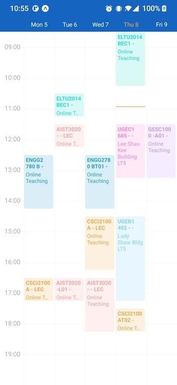

# React Native Timetable

React Native Timetable View



## Try It

Run example by performing the following steps:
```sh
git clone https://github.com/mikezzb/react-native-timetable.git
cd react-native-timetable
yarn install
yarn example install
yarn example android
```

## Installation

```sh
yarn add @mikezzb/react-native-timetable
```

## Usage
Use `events`
```tsx
import TimeTable from '@mikezzb/react-native-timetable';

// ...

<TimeTable
  events={[
  {
    courseId: 'CSCI2100',
    title: 'Data Structures',
    section: 'A - LEC',
    day: 3,
    startTime: '14:30',
    endTime: '16:15',
    location: 'Online Teaching',
    color: 'rgba(241,153,40,1)',
  },]}
  eventOnPress={(event) => Alert.alert(`${JSON.stringify(event)}`)}
/>
```

OR use `eventGroups`

```tsx
import TimeTable from '@mikezzb/react-native-timetable';

// ...

<TimeTable
  eventGroups={[
    {
      courseId: 'CSCI2100',
      title: 'Data Structures',
      sections: {
        'A - LEC': {
          days: [1, 3],
          startTimes: ['16:30', '14:30'],
          endTimes: ['17:15', '16:15'],
          locations: ['Online Teaching', 'Online Teaching'],
        },
        'AT02 - TUT': {
          days: [4],
          startTimes: ['17:30'],
          endTimes: ['18:15'],
          locations: ['Online Teaching'],
        },
      },
    },
  ]}
  eventOnPress={(event) => Alert.alert(`${JSON.stringify(event)}`)}
/>
```

## Types

### TimeTable Props

You can choose to pass either `eventGroups`  or `events` to make timetable events

| Property              | Type                          | Description                                                  |
| --------------------- | ----------------------------- | ------------------------------------------------------------ |
| `eventGroups`          | [`EventGroup[]`](#EventGroup) | Collection of event group, events parsed from one `eventGroup` share the same `courseId`, `title` and `color`, but different `section` |
| `events`    | [`Event[]`](#Event) | Collection of event, each `event` is a card displayed on timetable |
| `eventOnPress` | `(event) => any` | (Optional) On press function for an event card, event object will be passed as parameter |
| `eventColors` | `string[]`            | (Optional) Event card colors |
| `configs`       | [`Configs`](#Configs) | (Optional) Configurations like `numOfDays`, `startHour`, `timeTickWidth` |
| `headerStyle` | `ViewStyle` | (Optional) Header styles |
| `disableHeader` | `boolean` | (Optional) To disable weekdays header |
| `contentContainerStyle` | `ViewStyle` | (Optional) Event cards container styles |
| `theme` | `Theme` | (Optional) Overall theme for timetable, such as header , background, and text colors |

### Configs

Same index in events values array map to an event

| Property           | Type     | Description                                                  | Default |
| ------------------ | -------- | ------------------------------------------------------------ | ------- |
| `startHour`        | `number` | (Optional) Earliest grid hour in timetable in 24 hour        | 7       |
| `endHour`          | `number` | (Optional) Last grid hour in timetable in 24 hour            | 20      |
| `numOfDays`        | `number` | (Optional) Total number of days in timetable                 | 7       |
| `numOfDaysPerPage` | `number` | (Optional) Number of days in one page, horizontal scroll to view other days (if any) | 5       |
| `timeTicksWidth`   | `number` | (Optional) Width of time ticks bar                           | 52      |

### Event

Each event is a card displayed on timetable

| Property    | Type     | Description                                        |
| ----------- | -------- | -------------------------------------------------- |
| `startTime` | `string` | Event start time in `HH:MM` (24 hours format)      |
| `endTime`   | `string` | Event end time in `HH:MM` (24 hours format)        |
| `day`       | `number` | Weekday of the event (1 for Monday, 7 for Sunday)  |
| `location`  | `string` | Location of the event (Displayed as caption)       |
| `section`   | `string` | (Optional) Displayed next to title                 |
| `title`     | `string` | (Optional) Passed in `eventOnPress` but not showed |
| `color`     | `string` | (Optional) Color in `rgba` for that event card     |

### EventGroup

Collection of events sharing common properties like `courseId`

| Property   | Type                    | Description                                                  |
| ---------- | ----------------------- | ------------------------------------------------------------ |
| `courseId` | `string`                | Title for all events inside group                            |
| `sections` | [`Sections`](#Sections) | Object with key as section label, value as [`Events`](#Events) |
| `title`    | `string`                | (Optional) Title of the event (not displayed in timetable, but passed in `eventOnPress`) |

### Events

Same index in events values array map to an event, displayed as a collection of event cards with same color

| Property      | Type       |
| ------------- | ---------- |
| `startTimes`  | `string[]` |
| `endTimes`    | `string[]` |
| `days`        | `number[]` |
| `locations`   | `string[]` |
| `instructors` | `string[]` |

### Theme

| Property  | Type     | Description                                                 |
| --------- | -------- | ----------------------------------------------------------- |
| `primary` | `string` | (Optional) header color                                     |
| `accent`  | `string` | (Optional) highlighted weekday text color                   |
| `background` | `string` | (Optional) background color                                 |
| `text`    | `string` | (Optional) base color for timetable ticks and weekday texts |


## Example

```tsx
import * as React from 'react';

import { Alert, StatusBar, StyleSheet, View } from 'react-native';
import { SafeAreaProvider, SafeAreaView } from 'react-native-safe-area-context';
import TimeTable from '@mikezzb/react-native-timetable';

const eventGroups = [
  {
    courseId: 'AIST3020',
    title: 'Intro to Computer Systems',
    sections: {
      '- - LEC': {
        days: [2, 3],
        startTimes: ['11:30', '16:30'],
        endTimes: ['12:15', '18:15'],
        locations: ['Online Teaching', 'Online Teaching'],
      },
      '-L01 - LAB': {
        days: [2],
        startTimes: ['16:30'],
        endTimes: ['17:15'],
        locations: ['Online Teaching'],
      },
    },
  },
  {
    courseId: 'CSCI2100',
    title: 'Data Structures',
    sections: {
      'A - LEC': {
        days: [1, 3],
        startTimes: ['16:30', '14:30'],
        endTimes: ['17:15', '16:15'],
        locations: ['Online Teaching', 'Online Teaching'],
      },
      'AT02 - TUT': {
        days: [4],
        startTimes: ['17:30'],
        endTimes: ['18:15'],
        locations: ['Online Teaching'],
      },
    },
  },
  {
    courseId: 'ELTU2014',
    title: 'English for ERG Stds I',
    sections: {
      'BEC1 - CLW': {
        days: [2, 4],
        startTimes: ['10:30', '8:30'],
        endTimes: ['11:15', '10:15'],
        locations: ['Online Teaching', 'Online Teaching'],
      },
    },
  },
  {
    courseId: 'ENGG2780',
    title: 'Statistics for Engineers',
    sections: {
      'B - LEC': {
        days: [1],
        startTimes: ['12:30'],
        endTimes: ['14:15'],
        locations: ['Online Teaching'],
      },
      'BT01 - TUT': {
        days: [3],
        startTimes: ['12:30'],
        endTimes: ['14:15'],
        locations: ['Online Teaching'],
      },
    },
  },
  {
    courseId: 'GESC1000',
    title: 'College Assembly',
    sections: {
      '-A01 - ASB': {
        days: [5],
        startTimes: ['11:30'],
        endTimes: ['13:15'],
        locations: ['Online Teaching'],
      },
    },
  },
  {
    courseId: 'UGEB1492',
    title: 'Data Expl - Stat in Daily Life',
    sections: {
      '- - LEC': {
        days: [4],
        startTimes: ['14:30'],
        endTimes: ['17:15'],
        locations: ['Lady Shaw Bldg LT5'],
      },
    },
  },
  {
    courseId: 'UGEC1685',
    title: 'Drugs and Culture',
    sections: {
      '- - LEC': {
        days: [4],
        startTimes: ['11:30'],
        endTimes: ['13:15'],
        locations: ['Lee Shau Kee Building LT5'],
      },
    },
  },
  {
    courseId: 'Eat!',
    title: 'No work on SUNDAY!',
    sections: {
      '': {
        days: [7],
        startTimes: ['12:30'],
        endTimes: ['13:15'],
        locations: ['Home'],
      },
    },
  },
  {
    courseId: 'Manga!',
    title: '',
    sections: {
      '': {
        days: [6],
        startTimes: ['16:30'],
        endTimes: ['19:15'],
        locations: ['Home'],
      },
    },
  },
];

const events = [
  {
    courseId: 'AIST3020',
    title: 'Intro to Computer Systems',
    section: '- - LEC',
    day: 2,
    startTime: '11:30',
    endTime: '12:15',
    location: 'Online Teaching',
    color: 'rgba(253,149,141,1)',
  },
  {
    courseId: 'AIST3020',
    title: 'Intro to Computer Systems',
    section: '- - LEC',
    day: 3,
    startTime: '16:30',
    endTime: '18:15',
    location: 'Online Teaching',
    color: 'rgba(253,149,141,1)',
  },
  {
    courseId: 'AIST3020',
    title: 'Intro to Computer Systems',
    section: '-L01 - LAB',
    day: 2,
    startTime: '16:30',
    endTime: '17:15',
    location: 'Online Teaching',
    color: 'rgba(253,149,141,1)',
  },
  {
    courseId: 'CSCI2100',
    title: 'Data Structures',
    section: 'A - LEC',
    day: 1,
    startTime: '16:30',
    endTime: '17:15',
    location: 'Online Teaching',
    color: 'rgba(241,153,40,1)',
  },
  {
    courseId: 'CSCI2100',
    title: 'Data Structures',
    section: 'A - LEC',
    day: 3,
    startTime: '14:30',
    endTime: '16:15',
    location: 'Online Teaching',
    color: 'rgba(241,153,40,1)',
  },
  {
    courseId: 'CSCI2100',
    title: 'Data Structures',
    section: 'AT02 - TUT',
    day: 4,
    startTime: '17:30',
    endTime: '18:15',
    location: 'Online Teaching',
    color: 'rgba(241,153,40,1)',
  },
  {
    courseId: 'ELTU2014',
    title: 'English for ERG Stds I',
    section: 'BEC1 - CLW',
    day: 2,
    startTime: '10:30',
    endTime: '11:15',
    location: 'Online Teaching',
    color: 'rgba(3,218,197,1)',
  },
  {
    courseId: 'ELTU2014',
    title: 'English for ERG Stds I',
    section: 'BEC1 - CLW',
    day: 4,
    startTime: '8:30',
    endTime: '10:15',
    location: 'Online Teaching',
    color: 'rgba(3,218,197,1)',
  },
  {
    courseId: 'ENGG2780',
    title: 'Statistics for Engineers',
    section: 'B - LEC',
    day: 1,
    startTime: '12:30',
    endTime: '14:15',
    location: 'Online Teaching',
    color: 'rgba(0,142,204,1)',
  },
  {
    courseId: 'ENGG2780',
    title: 'Statistics for Engineers',
    section: 'BT01 - TUT',
    day: 3,
    startTime: '12:30',
    endTime: '14:15',
    location: 'Online Teaching',
    color: 'rgba(0,142,204,1)',
  },
  {
    courseId: 'GESC1000',
    title: 'College Assembly',
    section: '-A01 - ASB',
    day: 5,
    startTime: '11:30',
    endTime: '13:15',
    location: 'Online Teaching',
    color: 'rgba(187,134,252,1)',
  },
  {
    courseId: 'UGEB1492',
    title: 'Data Expl - Stat in Daily Life',
    section: '- - LEC',
    day: 4,
    startTime: '14:30',
    endTime: '17:15',
    location: 'Lady Shaw Bldg LT5',
    color: 'rgba(102,204,255,1)',
  },
  {
    courseId: 'UGEC1685',
    title: 'Drugs and Culture',
    section: '- - LEC',
    day: 4,
    startTime: '11:30',
    endTime: '13:15',
    location: 'Lee Shau Kee Building LT5',
    color: 'rgba(255,111,199,1)',
  },
  {
    courseId: 'Eat!',
    title: 'No work on SUNDAY!',
    section: '',
    day: 7,
    startTime: '12:30',
    endTime: '13:15',
    location: 'Home',
    color: 'rgba(50,144,144,1)',
  },
  {
    courseId: 'Manga!',
    title: '',
    section: '',
    day: 6,
    startTime: '16:30',
    endTime: '19:15',
    location: 'Home',
    color: 'rgba(211,124,177,1)',
  },
];

export default function App() {
  return (
    <SafeAreaProvider>
      <SafeAreaView style={styles.safeAreaContainer}>
        <StatusBar backgroundColor="rgba(21,101,192,1)" />
        <View style={styles.container}>
          <TimeTable
            eventGroups={eventGroups}
            // events={events}
            eventOnPress={(event) => Alert.alert(`${JSON.stringify(event)}`)}
          />
        </View>
      </SafeAreaView>
    </SafeAreaProvider>
  );
}

const styles = StyleSheet.create({
  safeAreaContainer: {
    flex: 1,
  },
  container: {
    flex: 1,
  },
});

```

## Contributing

See the [contributing guide](CONTRIBUTING.md) to learn how to contribute to the repository and the development workflow.

## License

MIT

